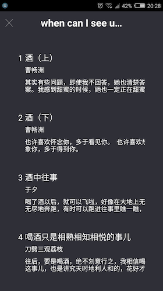
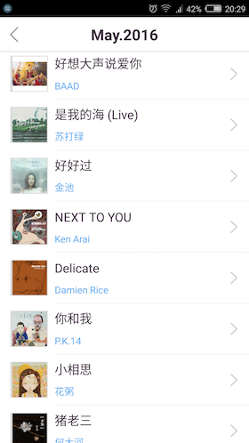
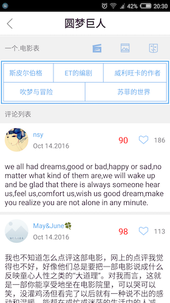

# 基于React-Native的高仿「ONE·一个」

> [「ONE·一个」](http://www.wandoujia.com/apps/one.hh.oneclient)是由韩寒监制，原《独唱团》主创成员共同制作的一款文艺生活APP

>  支持设备: Android 4.1+ and iOS 8.0+

## 声明
该APP所用到的API均由 [「ONE · 一个」](http://wufazhuce.com/)提供，[本人](https://github.com/lipeiwei-szu)采取非正常手段获取。获取跟共享的行为或许有侵犯权益的嫌疑。请您了解相关情况，并保证不侵犯[「ONE · 一个」](http://wufazhuce.com/)的利益，并遵守开源协议

## 技术交流
请添加qq群 436338753

## 项目描述
1. 基于React-Native框架开发，能同时运行在Android、iOS环境下，实现80%的代码复用，GitHub地址：[https://github.com/lipeiwei-szu/ReactNativeOne](https://github.com/lipeiwei-szu/ReactNativeOne)
2. 到目前为止，该项目均由本人独立完成，希望能有更多的小伙伴来一起完善这个项目。实现了「ONE·一个」绝大部分的功能点，涵盖了图文、阅读、音乐、电影四大版块，以下是功能列表
    + 使用ViewPager跟ListView展示图文列表、查看往期历史图文信息、点击查看大图
    + 三种系列（短篇、连载、问答）的文章阅读以及文章音频播放，查看往期文章列表
    + 音乐故事展示、音乐播放、查看历史音乐列表
    + 最近电影信息列表、查看电影详情页面、电影预告片播放、查看剧照列表
    + 查看文章、音乐、电影的评论列表，自定义扩展ListView，实现上拉加载更多数据
    + 微信好友分享、微信朋友圈分享
    + 缓存api接口数据，充分节省流量，增强用户体验

## 接口文档
请到[ONE-API](https://github.com/lipeiwei-szu/ONE-API)查看

## Android App下载

[ReactNativeOne-Android-V0.1 下载地址](http://fir.im/reactnativeone)

## iOS App下载
无苹果开发者账号, 暂时无法打包APP, 请亲自进行编译并在模拟器或手机上运行

## APP截图
 
 
 
 
 
 
 
 

## 整体思路
1. 分析「ONE·一个」App的业务逻辑结构，将整体业务按重要程度进行划分，安排整体开发流程
2. 在Mac环境下使用Charles软件抓包，抓取「ONE·一个」的网络接口数据，并整理接口文档，文档地址是[https://github.com/lipeiwei-szu/ONE-API](https://github.com/lipeiwei-szu/ONE-API)
3. 使用官方的Navigator管理全局路由，可自由配置Scene的出场动画，处理Android端的后退键事件
4. 使用FlexBox和jsx语法进行布局，并封装了一系列通用的组件，比如GridView、带上下拉功能的ListView、ImageViewer等，便于全局复用
5. 在Android原生端实现音频播放功能，并导出Native Api给React Native使用
6. 导入Video Native Api，自定义界面并实现电影预告片的加载播放
7. 导入GitHub第三方库react-native-wechat实现图文、阅读、音乐、电影的微信分享
8. 处理了App加载网络数据时的各种状态，比如加载中、加载成功、加载失败、点击屏幕重新进行加载等
9. 使用InteractionManager，保证每个页面都在转场动画结束时才进行耗时操作，使得切换页面时不卡顿，尽量减少View的层级，优化渲染性能
10. 在深刻理解的前提下引入redux相关功能，包括redux/react-redux/redux-thunk/redux-logger，设计与音频相关的全局state结构，使用redux管理与音频state相关的组件

## 目前所发现的bug以及尚未完成的功能点

### Android
1. Debug版本下的音乐版块，ViewPager嵌套ListView出现问题，Release版本正常
2. Image组件uri为空时完全不占位
3. 暂时没能在Android上实现iOS ScrollView的contentOffset这样的属性，具体效果请查看[「ONE·一个」](http://www.wandoujia.com/apps/one.hh.oneclient)的音乐版块

### iOS
1. ~~由于本人对iOS原生不熟悉，所以第三方库 [react-native-video](https://github.com/react-native-community/react-native-video)跟[react-native-wechat](https://github.com/weflex/react-native-wechat)都没能导入成功，所以iOS端暂时不能播放电影预告片跟进行微信分享~~(done)
2. 音频播放用的是原生的接口，Android我已写完了，iOS端还没有写，所以暂时无法播放音频
3. 阅读版块中有三种类型的文章，分别是短篇、连载、问答，在Android端显示时一切正常，但是在iOS端有的连载文章显示不出来，可能性有两点：文本有特殊字符导致整体无法显示、文字超长时Text标签无法正常显示(真机上运行一切正常, 所以应该是模拟器的问题)

### 共同问题
1. ~~音乐播放得加多一个中间状态，也就是缓冲状态，否则加载缓冲音频时间有可能太长，UI上全然无展示，体验太差~~
2. ~~点击顶部音乐控制Modal查看详情~~(done)
3. ~~在音频视频中加入可拖动的进度条~~(done)
4. ~~api接口数据缓存~~(done)
5. 音乐播放已经加多了缓冲状态, 但是在Android端, ActivityIndicator总是有问题, 特别是嵌套在Modal组件中的时候, 有时候会直接不旋转. iOS端正常
6. 首页中使用了很多个[ViewPager](https://github.com/lipeiwei-szu/react-native-viewpager), 没有实现重用和懒加载, 很耗费性能

## 将来也许会做的功能点
1. 搜索
2. 音频视频缓存
3. javascript热更新
4. 收藏
5. ......

## Build
1. clone this repo
2. npm install
3. react-native run-android or react-native run-ios

## 第三方库
1. [redux](https://github.com/reactjs/redux)
2. [react-redux](https://github.com/reactjs/react-redux)
3. [redux-thunk](https://github.com/gaearon/redux-thunk)
4. [redux-logger](https://github.com/evgenyrodionov/redux-logger)
5. [react-native-video](https://github.com/react-native-community/react-native-video)
6. [react-native-toast](https://github.com/remobile/react-native-toast)
7. [react-native-wechat](https://github.com/weflex/react-native-wechat)
8. [react-native-orientation](https://github.com/yamill/react-native-orientation)
9. [react-native-scrollable-tab-view](https://github.com/skv-headless/react-native-scrollable-tab-view)
10. [lipeiwei-szu/react-native-viewpager](https://github.com/lipeiwei-szu/react-native-viewpager)  which is fork [race604/react-native-viewpager](https://github.com/race604/react-native-viewpager)
11. [react-native-simple-store](https://github.com/search?utf8=%E2%9C%93&q=react-native-simple-store)

